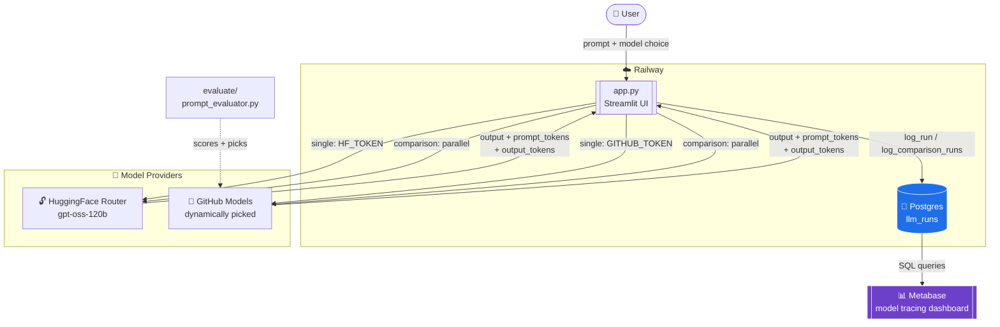
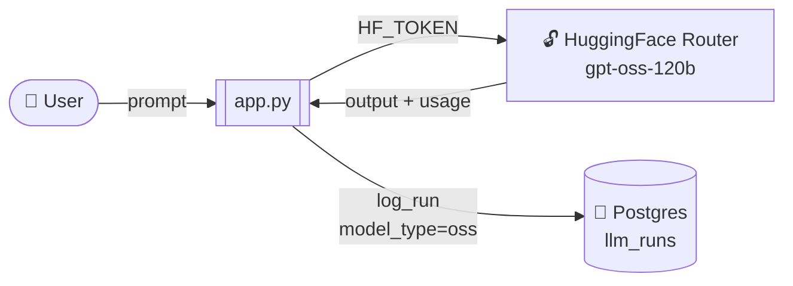
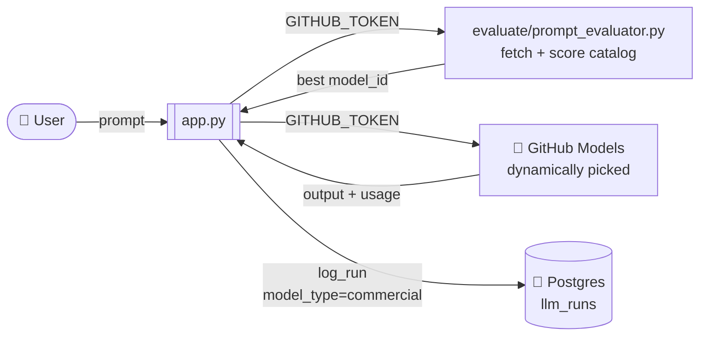
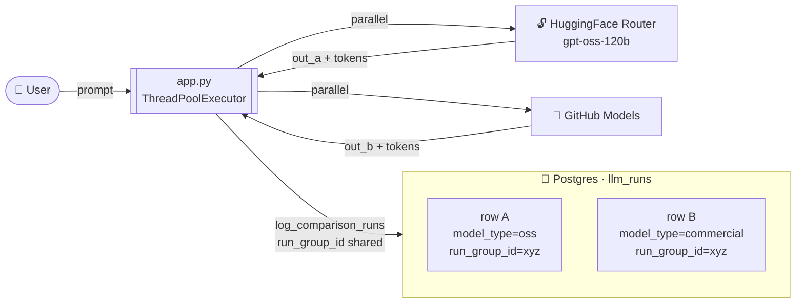

# Exciting Demos

#### Full architecture — end to end



**Flow:**
1. User selects a model (OSS, Commercial, or both) and submits a prompt
2. `app.py` calls the provider(s) — parallel via `ThreadPoolExecutor` in comparison mode
3. Token counts (`prompt_tokens`, `output_tokens`) are extracted from `response.usage`
4. Every run is logged to Postgres — single row for `oss`/`commercial`, two linked rows (same `run_group_id`) for `osscom`
5. **Metabase** connects directly to the Railway Postgres and visualises model usage, latency, and token consumption

## System to evaluate open-source vs closed-source models powered by GitHub models 

<!--  -->

A Streamlit app that runs the **same prompt** against an OSS model (`gpt-oss-120b` via HuggingFace) and a **commercial GitHub Model** (picked dynamically from the live catalog), side by side — then logs every call to Postgres on Railway.

---

#### Scenario 1 — Single OSS model run



---

#### Scenario 2 — Single Commercial model run



---

#### Scenario 3 — Side-by-side comparison (osscom)



---

#### Run it locally

```bash
cd prompt_process_trace_setup
pip install -r requirements.txt
cp .env.example .env          # fill in GITHUB_TOKEN, HF_TOKEN, DATABASE_URL
streamlit run app.py
```

#### Deploy on Railway

1. New project → deploy from this repo (root `prompt_process_trace_setup/`)
2. Add a **PostgreSQL** plugin → Railway injects `DATABASE_URL` automatically
3. Set `GITHUB_TOKEN` and `HF_TOKEN` as service variables
4. First request auto-creates the `llm_runs` table

#### Key files

| File | Purpose |
|---|---|
| `app.py` | Streamlit UI — single or side-by-side mode |
| `db.py` | Postgres schema · `log_run()` · `log_comparison_runs()` |
| `evaluate/prompt_evaluator.py` | Fetches the live GitHub Models catalog and picks the best commercial model |
| `prompt/prompt.md` | The test prompt (movie review of *Project Hail Mary*) |

#### DB schema

| Column | Type | Notes |
|---|---|---|
| `id` | serial | primary key |
| `run_at` | timestamptz | auto |
| `run_group_id` | text | shared UUID for osscom comparison rows |
| `model_id` | text | full model identifier |
| `model_type` | text | `oss` · `commercial` · `osscom` |
| `prompt` | text | |
| `output` | text | |
| `error` | text | null on success |
| `elapsed_sec` | float | wall-clock time |
| `prompt_tokens` | int | from `response.usage` |
| `output_tokens` | int | from `response.usage` |
| `mode` | text | `single` · `comparison` |


#### References
- [DataJourneyHQ/list-github-models](https://github.com/DataJourneyHQ/list-github-models)
- [Metabase](https://www.metabase.com) — open-source BI connected to Railway Postgres

### 25th March CrewAI Demos 

1. OSS Discovery + Deployed via GitHub Action @sayantikabanik
2. API-first asset librarian for local-first document and image similarity analysis. https://github.com/arcnem-ai/omnivec @Kthom1
---

## GitHub Actions — CrewAI OSS Discovery Agent

A `workflow_dispatch` workflow that runs the CrewAI agent on demand directly from GitHub Actions. No local setup, no OpenAI account — just a GitHub PAT.

**How it works:**
1. You trigger it manually from the Actions tab with 3 inputs: `criteria`, `programming_languages`, `project_types`
2. The agent uses `gpt-4o-mini` routed through GitHub's model endpoint (`https://models.inference.ai.azure.com`) — authenticated via your GitHub token
3. It searches the web for open source projects, scrapes repos, and writes a discovery report
4. The report is saved as both `.md` and `.html` and uploaded as a downloadable artifact

**Only 1 secret needed:**
| Secret | What it is |
|---|---|
| `GH_MODELS_TOKEN` | Your GitHub PAT with Models read permission |

---

## ⚠️ Hallucination Risk — This Workflow Has a Known Issue

The workflow currently **completes successfully even when the search tool fails.**

Here's what actually happens at runtime:

```
Agent calls SerperDevTool to search the web
        │
        ▼ ❌ 403 Forbidden — SERPER_API_KEY missing or invalid
        │
        │  ERROR: 403 Client Error: Forbidden
        │  Tool: search_the_internet_with_serper
        │  Iteration: 26 — all 25 retries exhausted
        │
        ▼
Agent falls back to LLM training knowledge
        │
        ▼ ✅ GitHub Actions reports SUCCESS
Artifact uploaded — looks like a normal report
```

### Why this is a risk

The output **looks completely valid** — proper markdown, real project names, GitHub URLs, star counts. But it is generated entirely from the LLM's training data (knowledge cutoff: early 2024), not from live web search. There are no guardrails in place to detect or reject this.

| Risk | Detail |
|---|---|
| **Stale data** | Projects may be archived, renamed, or no longer maintained |
| **Fabricated URLs** | Links may point to wrong or non-existent repos |
| **False confidence** | Report reads as authoritative with no warning it failed |
| **CI shows green** | Nothing in the pipeline signals that tools broke |


---
